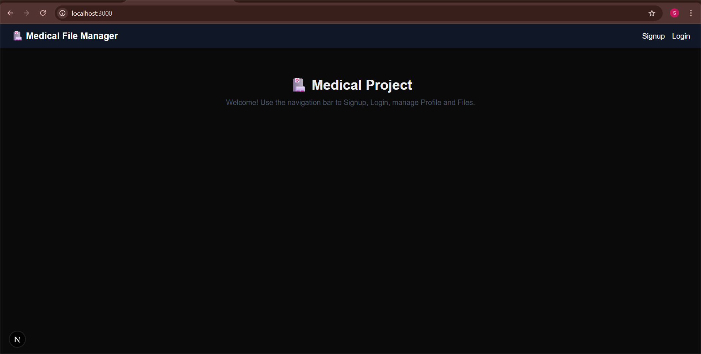
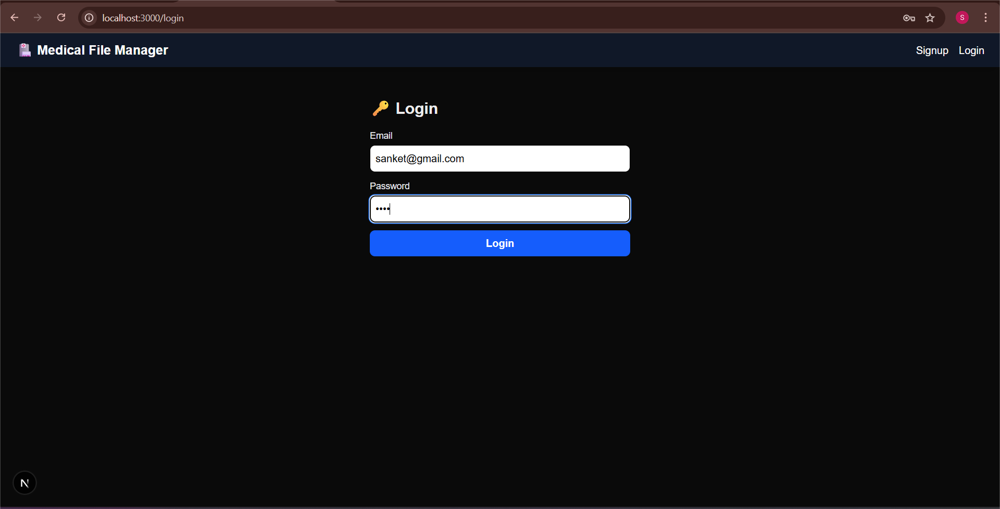
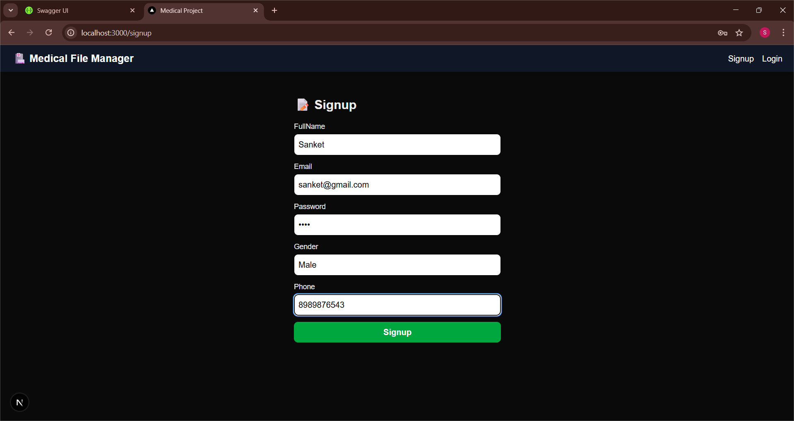
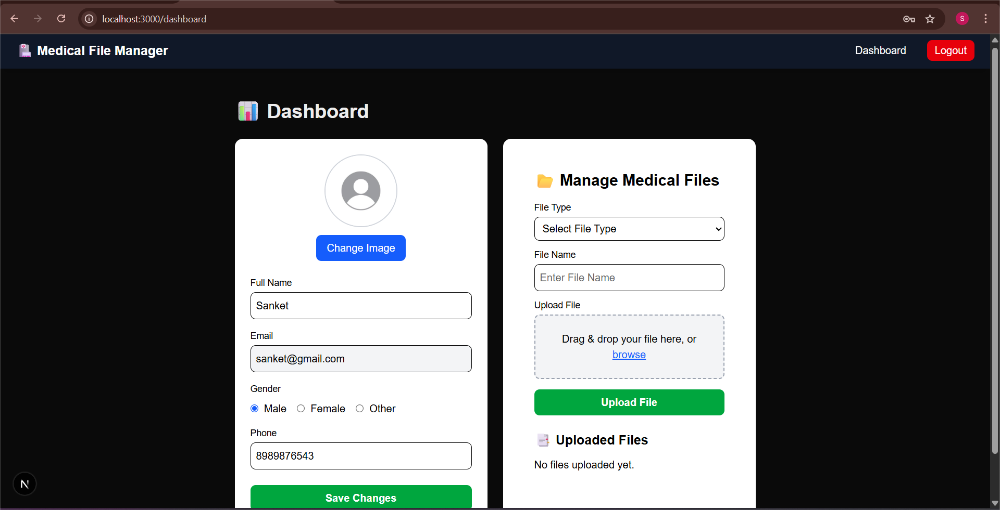
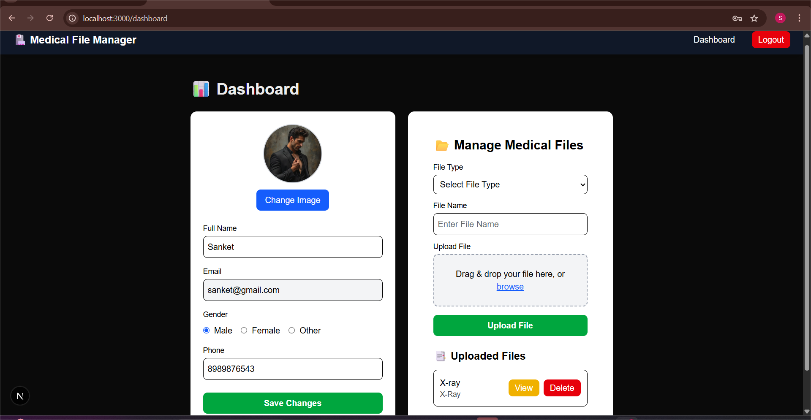

# MiniMedicalProject

    

# 📝 Description

MiniMedicalProject is a full-stack web application built with Next.js, React, TypeScript, and ASP.NET Core.
It provides a modern and responsive interface for managing medical information, with secure authentication, profile management, and file handling.

This project leverages Next.js performance optimizations, TypeScript type safety, and ASP.NET Core backend APIs, making it a strong foundation for future expansion.

---

# ✨ Features

* 🔐 User Authentication (Signup, Login, JWT-based auth)
* 👤 Profile Management (Update user info & upload avatar)
* 📂 File Upload & Storage (Manage medical files securely)
* 📊 Dashboard with user and file details
* 🌐 Modern UI with responsive design (Next.js + Tailwind)
* ⚡ Full-stack integration (ASP.NET Core backend + Next.js frontend)

---

# 📸 Screenshots

# 🏠 Homepage



# 🔐 Login Page



# 📝 Signup Page



# 📊 Dashboard




---

# 🛠️ Tech Stack

| Frontend | Backend      | Database          | Other Tools |
| -------- | ------------ | ----------------- | ----------- |
| Next.js  | ASP.NET Core | EF Core           | Axios       |
| React    | C#           | SQLite/SQL Server | TypeScript  |
| Tailwind | .NET 8       | Migrations        | REST API    |

---

# 📦 Key Dependencies

```json
axios: 1.11.0
next: 15.5.0
react: 19.1.0
react-dom: 19.1.0
```

---

# 🚀 Run Commands

* Dev: `npm run dev`
* Build: `npm run build`
* Start: `npm run start`
* Lint: `npm run lint`

---

# 📁 Project Structure

```
.
├── Backend
│   ├── Controllers
│   ├── Data
│   ├── Migrations
│   ├── Models
│   ├── Program.cs
│   └── MiniMedicalProject.sln
├── docs
│   ├── homepage.png
│   ├── loginpage.png
│   ├── signuppage.png
│   └── dashboardpage*.png
└── frontend
    ├── app
    ├── components
    ├── public
    └── utils
```

---

# 🛠️ Development Setup

# Node.js/Frontend Setup

1. Install Node.js (v18+)
2. Install dependencies:

   ```bash
   npm install
   ```
3. Start development server:

   ```bash
   npm run dev
   ```

# Backend (.NET Setup)

1. Install .NET 8 SDK
2. Navigate to `/Backend` and restore dependencies:

   ```bash
   dotnet restore
   ```
3. Run backend server:

   ```bash
   dotnet run
   ```

---

# 🛣️ Roadmap

* [ ] Role-based access (Admin, Doctor, Patient)
* [ ] Notifications system
* [ ] File preview & sharing
* [ ] Search functionality in dashboard
* [ ] CI/CD deployment (Azure / Vercel)

---

# 👥 Contributing

Contributions are welcome!

1. Fork the repository
2. Clone your fork:

   ```bash
   git clone https://github.com/CoderSanking/MiniMedicalProject.git
   ```
3. Create a branch:

   ```bash
   git checkout -b feature/your-feature
   ```
4. Commit changes:

   ```bash
   git commit -am "Add feature"
   ```
5. Push branch:

   ```bash
   git push origin feature/your-feature
   ```
6. Open a Pull Request 🎉

---

# 👨‍💻 Author

* Sanket Kadam
* GitHub: [CoderSanking](https://github.com/CoderSanking)
* LinkedIn: [Your LinkedIn](https://www.linkedin.com/in/sanketkadam9)

---

# 📜 License

This project is licensed under the MIT License.
